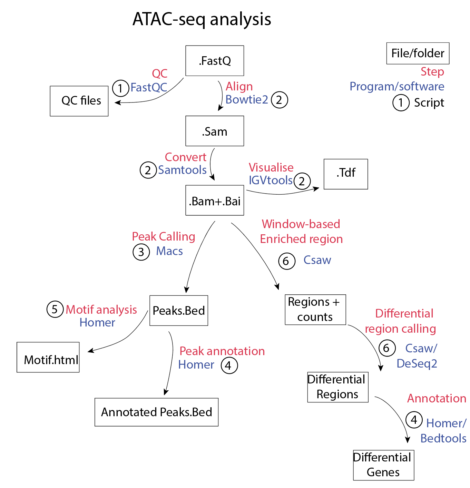

# ATAC-seq

This walkthrough will outline the general steps of analysing a ATAC-seq dataset from fastq files through to figure generation. 
Use ```--help``` for more available options with each software. 

If you're just interested in genes which are associated with open chromatin, ATAC-seq analysis is very similar to ChIP-seq.
More in-depth analysis, such as [footprinting](https://bioinformatics-core-shared-training.github.io/cruk-summer-school-2018/ChIP/Practicals/Practical10_ATAC-seq_analysis_SS.html), can also be performed with high resolution ATAC-seq data but will not be covered herein. 

[Here](https://informatics.fas.harvard.edu/atac-seq-guidelines.html) is a good tutorial walkthrough for ATAC-seq.


## Getting Started

The following walk-through provides an example of the analysis pipeline for ATAC-seq data. For the purposes of this example, we will be starting with demultiplexed fastq files. These samples have been sequenced single ended 75bp at approximately 20 million reads per sample. 

The software used have been referenced at the end, the majority of this analysis is based on the user manuals linked below, with only slight deviations from default settings.


### Library preparation
 
For more information about the ATAC-seq wetlab protocol please go [Here](https://www.ncbi.nlm.nih.gov/pmc/articles/PMC4374986/)


### General overview of ATAC-seq analysis steps




### Software requirements and Version Control

Bowtie2 /2.3.3

Bedtools /2.26

samtools /1.4.1

FastQC /0.11.5

macs /2.1.1

Deeptools /2.5.3


## Aligning Fastq Files

### QC
Perform QC on Fastq files using fastqc

[1_fastQC.sbatch](1_fastQC.sbatch)
```
module load fastqc

fastqc -o ${d} -f fastq --noextract -t 8 ${1}
```

### Align to reference genome with Bowtie2
Align Fastq files to the mouse genome (mm10) using Bowtie2. The resulting sam files are then sorted, converted to bam and indexed with samtools. IGV tools can then be used to visualise the TDF. You will need a Bowtie2 indexed reference genome. For paired ended data, use 2.2_ATAC_mouse_PE.sbatch*


[2.1_ATAC_mouse_SE.sbatch](2.1_ATAC_mouse_SE.sbatch)
```
module load bowtie2
module load samtools
module load igvtools

s=$(basename $1)
t=$(dirname $1)
x=`echo $s | cut -d "_" -f 1-2`
echo $s
echo $x

bowtie2 -p 32 -x /data/reference/indexes/mouse/mm10/bowtie2/Mus_musculus.GRCm38.dna.toplevel -U $1 -S ${1}.sam

samtools view -@ 8 -Sbo ${t}/${x}.sam.bam  ${t}/${x}.sam
samtools sort -@ 8 -o ${t}/${x}.sam.sorted.bam ${t}/${x}.sam.bam
samtools rmdup -s ${t}/${x}.sam.sorted.bam ${t}/${x}.sam.sorted.bam.rmdup.bam
samtools index ${t}/${x}.sam.sorted.bam.rmdup.bam ${t}/${x}.sam.sorted.bam.rmdup.bam.bai
igvtools count -z 5 -w 25 -e 225 ${t}/${x}.sam.sorted.bam.rmdup.bam ${t}/${x}.sam.sorted.bam.rmdup.bam.tdf mm10

```

## Peak Calling
This will produce a bed file of genomic coordinates of identified peaks or enriched regions. The resulting BED file can then be used as input for: peak annotation, motif analysis, differential peak analysis,input for deeptools compute matrix heatmap etc.

### macs
[HERE](https://hbctraining.github.io/Intro-to-ChIPseq/lessons/05_peak_calling_macs.html) is a great tutorial for peak calling with MACS. 

[3_MACS2.sbatch](3_MACS2.sbatch)

For broad peaks e.g. histone marks

For more narrow peaks e.g. transcription factor ChIP: 

```
module load macs

macs2 callpeak -g mm -f BAM -t ATAC.bam -c inputControl.bam --extsize 225 --nomodel --outdir ATACmacs2 -n ATACpeaks
```

You can annotate ATAC peaks using bedtools. You will need a reference genome in gtf or bed format. 

```
module load bedtools 
bedtools closest -D -a ATACpeaks.bed -b mm10reference.bed > ATACpeaks.annotated.bed

```

Peak calling for ATAC-seq can also be performed with a window based method such as Csaw. See the Csaw analysis section in the [ChIP seq walkthrough](https://github.com/madisonJK/ReferenceAnalysis/blob/master/ChIP-Seq/ChIPseq_WALKTHROUGH.md) for more info.

## Motif analysis

Motif analysis can be performed on a peak bed file with Homer. 
You may sometimes have trouble with the homer config directories, try ```-preparsedDir sample/```


[5_HomerFindMotifs.sbatch](5_HomerFindMotifs.sbatch)

```
module load homer

findMotifsGenome.pl ATACPeaks.bed mm10 ATAC-motif 
```

## Generating Figures

### Heatmap with Deeptools 

To generate a heatmap with deeptools, you will need: bam files and a reference bed file. The reference can be a reference genome with CDS or TSS, or it can be a peak summit bed file or a peak bed file generated by macs above. 

e.g. you could make a heatmap of H3k27Ac enrichment centered on ATAC peaks

You will first need to make bigwigs of your .bam files of interest. 

```
module load deeptools
bamCoverage -p 8 -e 225 --normalizeUsingRPKM -b ATAC.bam -o ATAC.bw
```

Then compute matrix for the regions you want to plot. 

reference-point is best for plotting heatmap of enrichment relative to TSS or ChIP-seq peaks. 

```
computeMatrix reference-point -S IPsample.bw  -R mm10TSS.bed -out ATACatTSS.gz -b 1000 -a 1000
```

From the created matrix you can then plot a heatmap:
*see plotHeatmap --help for more options*

```
plotHeatmap -m ATACatTSS.gz -out ATACatTSS.pdf   
``` 


## Acknowledgments


* **Madison Kelly** - *Author of this walkthrough* [madisonJK](https://github.com/madisonJK)

* Stephin Vervoort - *Helping with initial ATAC-seq analysis*


## Further information and useful tutorials

[Good Overview of ATAC-seq preparation and analysis](https://informatics.fas.harvard.edu/atac-seq-guidelines.html)

[ATAC-seq tutorial](https://bioinformatics-core-shared-training.github.io/cruk-summer-school-2018/ChIP/Practicals/Practical10_ATAC-seq_analysis_SS.html)

[ATAC-seq workshop](http://dors.weizmann.ac.il/course/ATAC-seq/ATAC_workshop_July2018_final.pdf)


## References

Buenrostro, J. D., Wu, B., Chang, H. Y., & Greenleaf, W. J. (2001). ATAC-seq: A Method for Assaying Chromatin Accessibility Genome-Wide (Vol. 11). Hoboken, NJ, USA: John Wiley & Sons, Inc.


