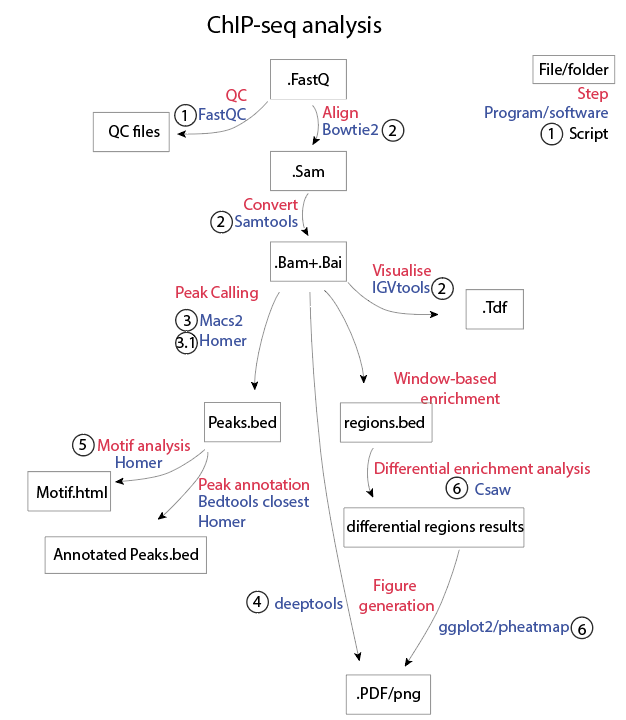

# ChIP-seq

This walkthrough will outline the general steps of analysing a ChIP-seq dataset from fastq files through to figure generation. 
see ```--help``` or ```?function``` for more available options at each step. 

## Getting Started

The following walk-through provides an example of the analysis pipeline for ChIP-seq data. For the purposes of this example, we will be starting with demultiplexed fastq files. These files have been sequenced single ended 75bp at approximately 20 million paired reads per sample. An input control will be used below, but you could also use an IgG contorol as well. 

The PeterMac bioinformatics core automatically applies Seqliner2.0 pipeline to the Fastq files to produce .bam and .bai files. If you wish to start with these skip to the **Peak Calling** section.

The software used have been referenced at the end, the majority of this analysis is based on the user manuals linked below, with only slight deviations from default settings. 

*It is important to keep in mind there are MANY ways of analysing ChIP-seq data. Outlined below are just a few ways this analysis has been performed in the Johnstone/Kats lab. There are multiple useful links below in **Further information and useful tutorials** if you require alternative methods of analysis.*


### Library preparation
 
For more information about the ChIP-seq wetlab protocol please go [Here](https://www.jove.com/video/55907/chromatin-immunoprecipitation-chip-in-mouse-t-cell-lines)
Indexed libraries are generally prepared by the Peter Mac Molecular Genomics Core using KAPA Hyper Prep Kit for Illumina platforms (Kapa Biosystems, Roche, cat: 07962363001) and the SeqCap Adapter Kit (Roche, cat: 07141530001) following vendor’s instructions. 

### General overview of CHIP-seq analysis




### Software requirements and Version Control

Bowtie2 /2.3.3

Bedtools /2.26

samtools /1.4.1

FastQC /0.11.5

macs /2.1.1

Homer /4.8

Deeptools /2.5.3


R: 

Limma/

Deseq/ 

Csaw

ggplot2/3.3.1

reshape2/1.4.3

pheatmap/1.0.12


## Aligning Fastq Files

### QC
Perform QC on Fastq files using fastqc

[1_fastQC.sbatch](1_fastQC.sbatch)
```
mkdir Fastqc/

module load fastqc

fastqc -o Fastqc/ -f fastq --noextract -t 8 Sample.fastq.gz
```

### Align to reference genome with Bowtie2
Align Fastq files to the mouse genome (mm10) using Bowtie2. The resulting sam files are then sorted, converted to bam and indexed with samtools. IGV tools can then be used to visualise the TDF. You will need a Bowtie2 indexed reference genome. For paired ended data, see the [PE script](2.2_ChIPseq_bowtie2_mouse_PE.sbatch). 
If you have an ERCC OR/AND an S2 spike-in, you will need to map to a merged reference genome e.g. mm10+ERCC OR mm10+DM3 OR mm10+DM3+ERCC.

[2_ChIPseq_bowtie2_mouse_SE.sbatch](2_ChIPseq_bowtie2_mouse_SE.sbatch)
```
module load bowtie2
module load samtools
module load igvtools

bowtie2 -p 32 -x /data/reference/indexes/mouse/mm10/bowtie2/Mus_musculus.GRCm38.dna.toplevel -U Sample.fastq.gz -S Sample.sam

samtools view -@ 8 -Sbo Sample.sam.bam  Sample.sam
samtools sort -@ 8 -o Sample.sorted.bam Sample.sam.bam
samtools rmdup -s Sample.sorted.bam Sample.sorted.rmdup.bam
samtools index Sample.sorted.rmdup.bam Sample.sorted.rmdup.bam.bai
igvtools count -z 5 -w 25 -e 225 Sample.sorted.rmdup.bam Sample.tdf mm10

```
Remove intermediate files

```
rm Sample.sam
rm Sample.sam.bam
rm Sample.sorted.bam
```

## Peak Calling
This will produce a bed file of genomic coordinates of identified peaks or enriched regions. The resulting BED file can then be used as input for: peak annotation, motif analysis, differential peak analysis,input for deeptools compute matrix heatmap etc.

### MACS2
[HERE](https://hbctraining.github.io/Intro-to-ChIPseq/lessons/05_peak_calling_macs.html) is a great tutorial for peak calling with MACS. 

It is important to identify which settings will produce the best peaks

--broad : Use this option for broader-style enrichment patterns such as histone marks including H3k27me3 or H2Ak110ub.

--cutoffanalysis : Recommended to run this first to see how changing the p/q value impacts the number and width of the peaks.

see macs2 callpeak --help for more info

[3_MACS2.sbatch](3_MACS2.sbatch)

For broad peaks e.g. histone marks
```
module load macs

macs2 callpeak -g mm -f BAM -t Sample.sorted.rmdup.bam -c INPUTSAMPLE.rmdup.bam --broad --broad-cutoff 0.1 --cutoff-analysis --outdir Sample_broad_macs2 -n Sample_broad_peaks
```

For more narrow peaks e.g. transcription factor ChIP: 

```
module load macs

macs2 callpeak -g mm -f BAM -t $1 -c Sample.sorted.rmdup.bam --cutoff-analysis --outdir Sample_macs -n Samplepeaks
```


### Homer
Please see [HERE](http://homer.ucsd.edu/homer/ngs/peaks.html) for a more comprehensive tutorial on calling peaks with Homer.
First, a tag directory needs to be made. Make a tag directory for all samples, including input/igG control.
Homer uses .sam files, so you will need to open the final processed bam files as .sam files using samtools.

[3.1_HomerTagDir.sbatch](3.1_HomerTagDir.sbatch)
```
module load homer
module load samtools

 
samtools view -h Sample.sorted.rmdup.bam > Sample.sam
makeTagDirectory Sampletagdir/ Sample.sam -format sam

```
You can then use these tag directories to call peaks on your IP samples relative to your control. The peaks can then be converted to a bed file, which can then be annotated with homers annotatePeaks.pl. (You may need to add "chr" to the start if your reference genome does not include it - see line 3 below).

```
findPeaks Sampletagdir/ -style factor -o auto -i InputControltagdir/ 
pos2bed.pl -o Sampletagdir/Samplepeaks.bed Sampletagdir/Samplepeaks.txt
awk '{print "chr"$0}' Sampletagdir/Samplepeaks.bed > Sampletagdir/Samplepeaks.chr.bed
annotatePeaks.pl IPtagdir/peaks.bed.chr.bed mm10 > IPtagdir/peaksannotated.txt
```
Homer can also be used for Superenhancer-style analysis: 

[3.1.1_HomerTagSuperE.sbatch](3.1.1_HomerTagSuperE.sbatch)
 ``` 
findPeaks IPtagdir/ -i InputControltagdir -style super -o IPtagdir/IPSuper.txt -superSlope -1000 -L 2 -typical IPnormalpeaks.txt

 ```

You can also annotate peaks using bedtools. You will need a reference genome in gtf or bed format. 

```
module load bedtools 
bedtools closest -D -a IPpeaks.chr.bed -b mm10reference.bed > IPpeaks.annotated.bed

```

### Finding enriched regions with Csaw
Csaw is an R package which employs window based analysis to calculate enriched regions in your IP sample compared to input control. The analysis is very similar to RNA-seq analysis.
Load required packaged: 

```
library(csaw)
library(pheatmap)
library(ggpubr)
library(reshape2)
library(GenomicRanges)
library(genomation)
```

Read in bam files, filter out regions with low logcpm values: 

```
setwd(bamfiledir)
bamfiles <- list.files( pattern = ".bam$")
data_all <- windowCounts(bamfiles], ext=200, width=1000,bin=T)

#filter out low logcpm values
data_keep<- aveLogCPM(asDGEList(data_all)) >= 0
data_all <- data_all[data_keep,]
```

Filter out regions which do not surpass input with a logFC >3

```
input<-data_all [,6]
IP<-data_all [,c(1:5)]
filter.stat<-filterWindows(IP, input, type="control",prior.count =5,norm.fac=list(IP, input))
keep <- filter.stat$filter > log2(2)
data<-IP[keep,]
```
These regions can be merged together to make a bed file similar to a peaks file as above, or can continue to differential enrichment analysis below. 

```
mergedWindows <- mergeWindows(rowRanges(data), tol=1000L)
write.table(as.data.frame(merged$region),file = "enrichedPeaks.bed", quote = F, sep = "\t")  
```

### Differential enrichment analysis with Csaw (with replicates)

make sample Info, design and contrast matrix 

```
SI<-matrix(data = NA,nrow=5,ncol=2)
SI[,1]<-c(1:5)
SI[,2]<-c("B","B","B","A","A")
colnames(SI)<-c("Sample","Treatment")
SI<-as.data.frame(SI)


#create concatination of group for design matrix
group <- paste(SI$Treatment,sep=".")
group <- factor(group)
design <- model.matrix(~ 0 + group)
colnames(design) <- levels(group)
cont.matrix <- makeContrasts(AvsB =B-A,
                             levels=design)
```

normalise and make a DGE list 

```
totals <- data@colData$totals
norm <- normOffsets(data, lib.sizes=totals)
y <- asDGEList(data, norm.factors=norm)

y <- estimateDisp(y, design,trend.method = "loess")

```

fit to model and find results

```
fit <- glmQLFit(y, design, robust=TRUE)

results <- glmQLFTest(fit,contrast = cont.matrix)
Results<-results$table
```

Merge the adjusted counts, Chromosome locations and Results together and save master Results table

```
adj.counts<- cpm(y, log=TRUE)

colnames(adj.counts)<-c("B1","B2","B4","A1","A2")

adj.counts_sortedbypvalue <- adj.counts[order(Results$PValue),]

merged<-merge(results,adj.counts,by= "row.name")
rownames(merged) <- merged$Row.names
merged$Row.names <- NULL

Ranges<-data.frame(data@rowRanges)
mergedlocation <- merge(merged,Ranges,by="row.names")
mergedlocation<-mergedlocation[order(mergedlocation$PValue),]
filter<-mergedlocation[(mergedlocation$PValue<0.01 & mergedlocation$logFC<(-0.3)),]
filterlocation<-filter[,11:15]

chr<-paste("chr",filterlocation$seqnames,sep="")
filterlocation$seqnames<-chr

x<-data.frame(data_@rowRanges)
chr <- paste("chr",x$seqnames,sep="")
x$seqnames<-chr
write.table(x,file = "alllocation.bed",row.names = F,col.names = F, quote = F,sep = "\t")

```

The resulting file can be converted to a bedfile and used as a peaks file for annotation with bedtools or downstream analysis.


## Motif analysis

Motif analysis can be performed on a peak bed file with Homer. 
You may sometimes have trouble with the homer config directories, try ```-preparsedDir IPsample/```

If you have the data, it may be a good idea to set the background as ATAC peaks from the same cell type to reduce bias for open regions of the genome. ```-bg ATACpeaks.bed```

[5_HomerFindMotifs.sbatch](5_HomerFindMotifs.sbatch)

```
module load homer

findMotifsGenome.pl SamplePeaks.bed mm10 Sample-motif 
```

## Generating Figures

### Heatmap with Deeptools 

To generate a heatmap with deeptools, you will need: bam files and a reference bed file. The reference can be a reference genome with CDS or TSS, or it can be a peak summit bed file or a peak bed file generated by macs or homer above. 

You will first need to make bigwigs of your .bam files, including of the input control.

```
module load deeptools
bamCoverage -p 8 -e 225 --normalizeUsingRPKM -b IPsample.bam -o IPsample.bw
```

Then compute matrix for the regions you want to plot. 
scale-regions will this is good for enrichment accross gene features, e.g. metagene plots.

```
computeMatrix scale-regions -S IPsample.bw -R ref/mm10reference.bed -out IPsample-mm10genes.gz -b 1000 -a 1000
```

reference-point is better for plotting heatmap of enrichment relative to TSS, or peak summits. 

```
computeMatrix reference-point -S IPsample.bw  -R mm10TSS.bed -out IPsample-mm10TSS.gz -b 1000 -a 1000
```

From the created matrix you can then plot a heatmap:
*see plotHeatmap --help for more options*

```
plotHeatmap -m IPsample-mm10TSS.gz -out IPsample-mm10TSS.pdf   
``` 

### Figures with R (from Csaw analysis)

#### Heatmap

```
pheatmap(adj.counts_sortedbypvalue[1:100,],scale = "row",show_rownames = F,border_color = NA,
         main = c("top 100 significanlty differentially enriched regions"),file = "Heatmap.pdf")
```

#### Boxplot

```
boxplot(adj.counts_sortedbypvalue[1:100,])
boxplotshort<-as.data.frame(t(adj.counts_sortedbypvalue[1:100,]))
boxplotshort$group<-c("B","B","B","A","A")
boxplotshort$group <- factor(boxplotshort$group,
                                 levels = c("A","B"),ordered = TRUE)
melt<- melt(boxplotshort, id.var = "group")

ggplot(data = melt, aes(x=group, y=value)) + geom_boxplot(aes(fill=group)) + 
  theme_light() + scale_fill_brewer(palette="Set1",direction=-1)+ xlab("") +
  ylab("Normalised CPM")+ 
  stat_compare_means(method = "t.test",aes(label = paste('p =', ..p.format..)))+ 
  ggtitle("Top 100 significantly enriched regions")

```


## Acknowledgments


* **Madison Kelly** - *Author of this walkthrough* [madisonJK](https://github.com/madisonJK)

* Stephin Vervoort - *Initial ChIP-seq analysis*


## Further information and useful tutorials

[Homer tutorials](http://homer.ucsd.edu/homer/index.html)

[Deeptools tutorials](https://deeptools.readthedocs.io/en/develop/)

[Csaw User Guide](https://www.bioconductor.org/packages/devel/workflows/vignettes/csawUsersGuide/inst/doc/csaw.pdf)

[Good ChIP-seq analysis tutorial](https://github.com/crazyhottommy/ChIP-seq-analysis) 


## References

Heinz, S., Benner, C., Spann, N., Bertolino, E., Lin, Y. C., Laslo, P., ... & Glass, C. K. (2010). Simple combinations of lineage-determining transcription factors prime cis-regulatory elements required for macrophage and B cell identities. Molecular cell, 38(4), 576-589.

Lun, A. T., & Smyth, G. K. (2015). csaw: a Bioconductor package for differential binding analysis of ChIP-seq data using sliding windows. Nucleic Acids Research, 44(5), e45.

Ramírez, F., Dündar, F., Diehl, S., Grüning, B. A., & Manke, T. (2014). deepTools: a flexible platform for exploring deep-sequencing data. Nucleic acids research, 42(W1), W187-W191.


Zhang, Y., Liu, T., Meyer, C. A., Eeckhoute, J., Johnson, D. S., Bernstein, B. E., ... & Liu, X. S. (2008). Model-based analysis of ChIP-Seq (MACS). Genome biology, 9(9), R137.


